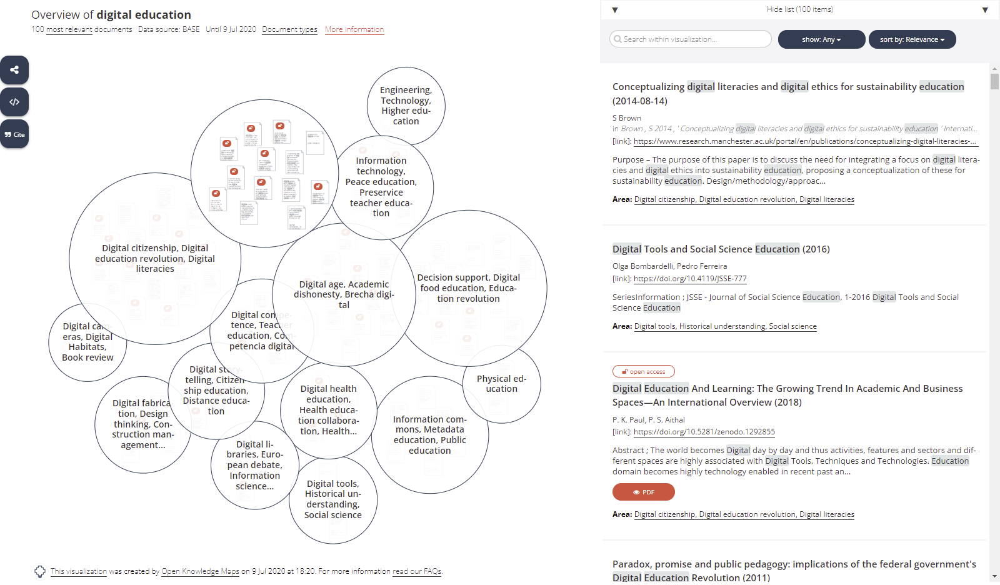

# Head Start

Head Start is a web-based knowledge mapping software intended to give researchers  a head start on their literature review (hence the name). It comes with a powerful backend that is is capable of automatically producing knowledge maps from a variety of data, including text, metadata and references.

## Getting Started

### Client
In order to get started quickly, Make sure to have `npm` version 3.10.10 installed (it comes with Node.js 6.12.0, you can [download installers here](https://nodejs.org/dist/latest-v6.x/)) and run the following two commands to build the Headstart Client.

    npm install
    npm run dev

We are using [webpack](https://webpack.github.io/) to build our client-side application. `webpack` is started in *watch mode* which means that changes to files are tracked and the created `headstart.js` is automatically updated.

Open a new file named `config.js` in the main `Headstart` folder, looking like `config.example.js`, and change the publicPath to the path of the dist directory.
Dev: specify a full path including protocol (it's usually the same path specified in the example).
Production: specify full path excluding protocol e.g. `//openknowledgemaps.org/headstart/dist`

Now you can run a local dev server:

	npm start

Point your browser to the following address:

	http://localhost:8080/examples/local_files/index.html

If everything has worked out, you should see the visualization shown above.

See [client configuration](doc/README.md) for details on adapting the client.

 Also see visualization [options](doc/README.md#visualisation-settings).

### Server

See [Installing and configuring the server](doc/server_config.md) for instructions on how to install and configure the server. Also, see [HOWTO: Get the search repos example to work](doc/howto_search_repos.md).

## Contributors

Maintainer: [Peter Kraker](https://github.com/pkraker) ([pkraker@openknowledgemaps.org](mailto:pkraker@openknowledgemaps.org))

Authors: [Asura Enkhbayar](https://github.com/Bubblbu), [Scott Chamberlain](https://github.com/sckott), [Chris Kittel](https://github.com/chreman), [Maxi Schramm](https://github.com/tanteuschi), [Rainer Bachleitner](https://github.com/rbachleitner), [Mike Skaug](https://github.com/mikeskaug), [Philipp Weissensteiner](https://github.com/wpp), and the [Open Knowledge Maps team](http://openknowledgemaps.org/team)

## Features

* Interactive, web-based knowledge maps based on [D3.js](https://d3js.org), following Shneiderman's principle of "overview first, zoom and filter, then details-on-demand"
* Synchronized list representation of documents complementing the knowledge map
* Integrated PDF viewer and annotation tool, courtesy of [Hypothes.is](https://hypothes.is)
* Powerful server component written in PHP and R for the creation of knowledge maps, including algorithms for clustering, ordination and labelling
* Connectors to a number of academic search engines through [rOpenSci](https://ropensci.org), including [BASE](https://base-search.net), [PubMed](https://www.ncbi.nlm.nih.gov/pubmed), [PLOS](https://plos.org) and [DOAJ](https://doaj.org)
* Persistence and versioning system based on SQLite

## Showcases

* [Open Knowledge Maps](http://openknowledgemaps.org/): Creates a visualization on the fly based on a user's search in either BASE or PubMed.
* [Overview of Educational Technology](http://openknowledgemaps.org/educational-technology): A working prototype for the field of educational technology based on co-readership.
* [Timeline of UMAP Conferences](http://stellar.know-center.tugraz.at/umap/): A prototype showcasing an overview of two years of the UMAP Conferences.
* [Conference Navigator 3](http://halley.exp.sis.pitt.edu/cn3/visualization.php?conferenceID=131) [registration required]: An adaptation of Head Start for the conference scheduling system CN3. This version enables users to schedule papers directly from the visualization. Scheduled papers and recommended papers are highlighted.
* [Organic Edunet portal](http://organic-edunet.eu/en/#/recommended): Overview of recommended resources in the Organic Eudnet portal.

## Compatibility

The visualization has been successfully tested with Chrome, Firefox, Safari and Microsoft Edge. Unfortunately, Internet Explorer is not supported due to the fact that it is not possible to insert HTML into a foreignObject.

## Background

More information can be found in the following papers:

Kraker, P., Kittel, C., & Enkhbayar, A. (2016). [Open Knowledge Maps: Creating a Visual Interface to the World’s Scientific Knowledge Based on Natural Language Processing](http://0277.ch/ojs/index.php/cdrs_0277/article/view/157/355). 027.7 Journal for Library Culture, 4(2), 98–103. doi:10.12685/027.7-4-2-157

Kraker, P., Schlögl, C. , Jack, K. & Lindstaedt, S. (2015). [Visualization of Co-Readership Patterns from an Online Reference Management System](http://arxiv.org/abs/1409.0348). Journal of Informetrics, 9(1), 169–182. doi:10.1016/j.joi.2014.12.003

Kraker, P., Weißensteiner, P., & Brusilovsky, P. (2014). [Altmetrics-based Visualizations Depicting the Evolution of a Knowledge Domain](http://know-center.tugraz.at/download_extern/papers/sti_visualization_evolution_kraker_etal.pdf). In 19th International Conference on Science and Technology Indicators (pp. 330–333).

Kraker, P., Körner, C., Jack, K., & Granitzer, M. (2012). [Harnessing User Library Statistics for Research Evaluation and Knowledge Domain Visualization](http://know-center.tugraz.at/download_extern/papers/user_library_statistics.pdf). Proceedings of the 21st International Conference Companion on World Wide Web (pp. 1017–1024). Lyon: ACM. doi:10.1145/2187980.2188236

## License
Head Start is licensed under [LGPL v3](http://www.gnu.org/copyleft/lesser.html).

## Citation
If you use Head Start in your research, please cite it as follows:

Kraker, P., Enkhbayar, A., Chamberlain, S., Kittel, C., Schramm, M., Bachleitner, R., Weissensteiner, P. & Skaug, M. (2017). Headstart v3.5. Zenodo. http://doi.org/10.5281/zenodo.569062
